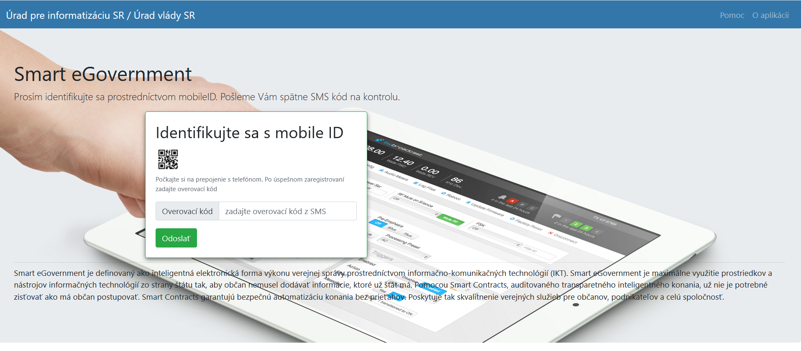
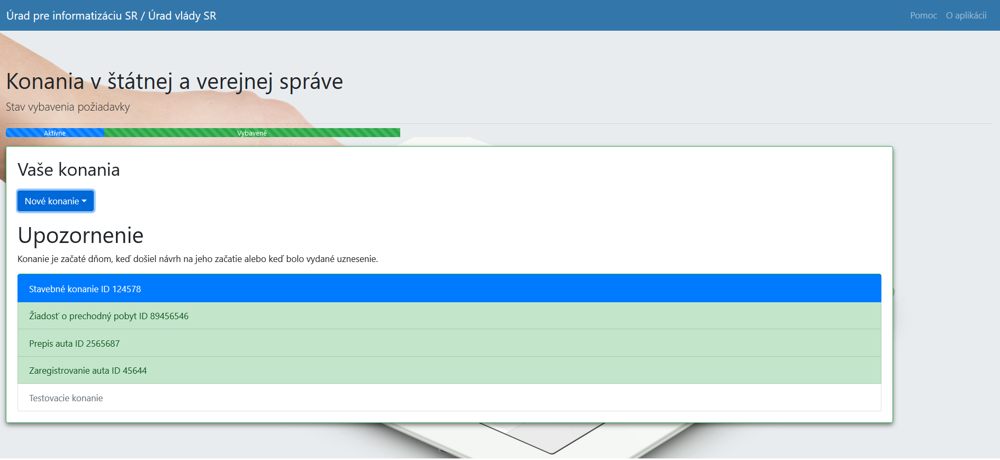
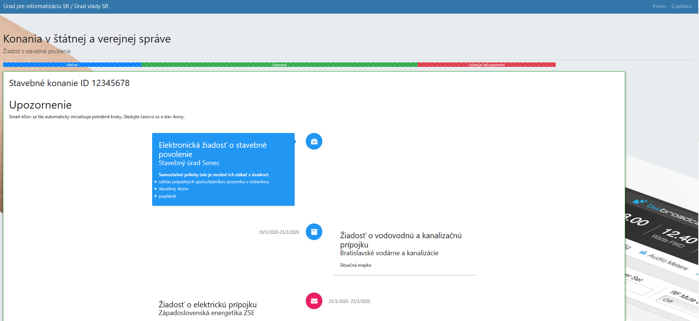
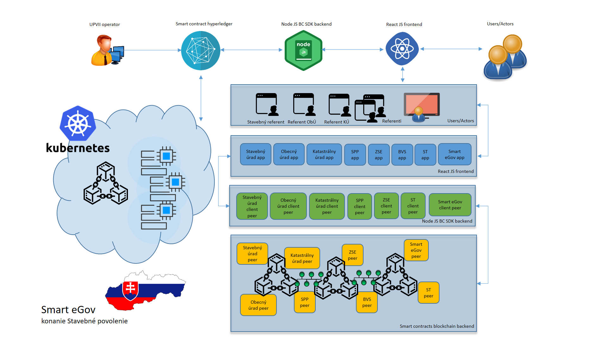

## Smart eGovernment

Smart eGovernment je definovaný ako inteligentná elektronická forma výkonu verejnej správy prostredníctvom informačno-komunikačných technológií. Smart eGovernment je maximálne využitie prostriedkov a nástrojov informačných technológií zo strany štátu tak, aby občan nemusel dodávať informácie, ktoré už štát má.
Pomocou Smart Contracts, auditovaného transparetného inteligentného konania, už nie je potrebné zisťovať ako má občan postupovať. Smart Contracts garantujú bezpečnú automatizáciu konania bez prieťahov.
Poskytuje tak skvalitnenie verejných služieb pre občanov, podnikateľov a celú spoločnosť.

### Smart contract digitálna štátna a verejná správa 
Automatizované digitálne konania občan <-> štátna a verejná správa na základe podnetu účastníka konania cez digitálne kanály, portál, mobilná aplikácia cez mobileID.
Využíva technológiu smart contracts v blockchain, automatizované, účastníkmi konania-kontraktu plne auditovateľné, zabezpečené voči fraudu a neoprávnenému pozmeňovaniu.
Eliminuje prieťahy v konaní, automaticky koná na základe pravidiel a zákonnej lehoty, archivuje a zaznamenáva stav.
Využíva technológiu cloudu, platba len za použitie, IaaS, PaaS.

Zvyšuje transparentnosť konania, spokojnosť občana, automatizáciou procesu zeefektívňuje štátnu správu, šetrí náklady na duplikované systémy v agendách jednotlivých účastníkov cez zdielaný informačný ledger. 

Pohľad na aplikačný frontend

* Prihlasovacia obrazovka

* Príklad zobrazenia konaní identifikovaného účastníka

* Príklad rozbehnutého stavebného konania identifikovaného účastníka

###  Dizajn riešenia Smart eGov

* Operátor blokchainu vytvorí prostredníctvom dedikovanej konzoly Oracle cloud blockchain platform a Oracle Kubernetes service. Vytvorí zúčastnených vlastníkov konania, peerov.
* Oracle cloud blockchain platform vytvorí Hyperledger fabric sieť spolu s Kubernetes kontajnermi NodeJS serverov. Operátor vytvorí a inicializuje Smart kontrakty na základe procesného predpisu konania.
* Node JS servre bežiace na compute inštanciách využívajú Fabric SDK na komunikáciu s blockchain platformou.
* React JS frontend aplikácia využíva Node JS API
* Užívatelia a referenti úradov komunikujú a vytvárajú úkony konania prostredníctvom React JS webovej a mobilnej aplikácie.

